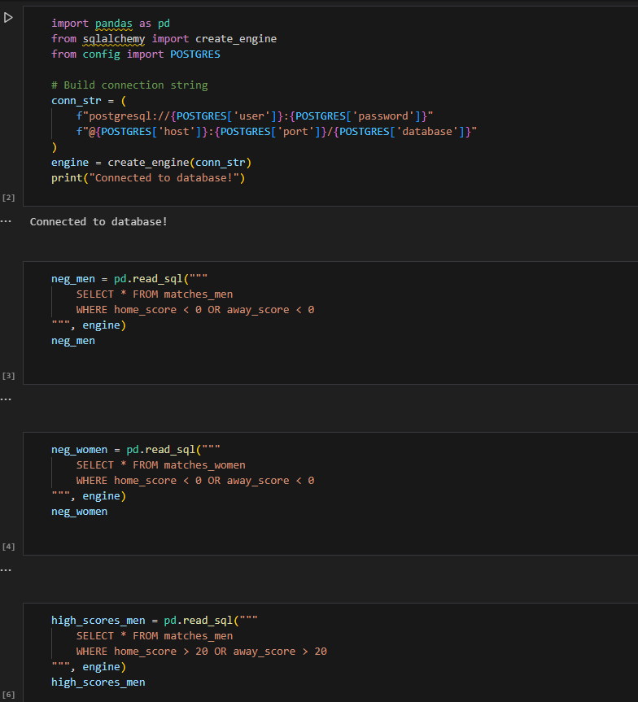
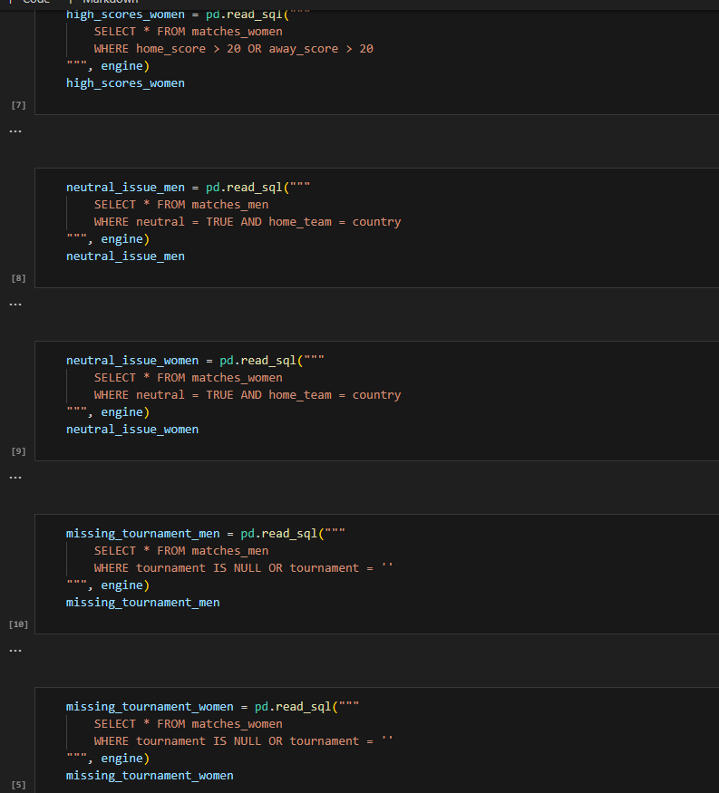
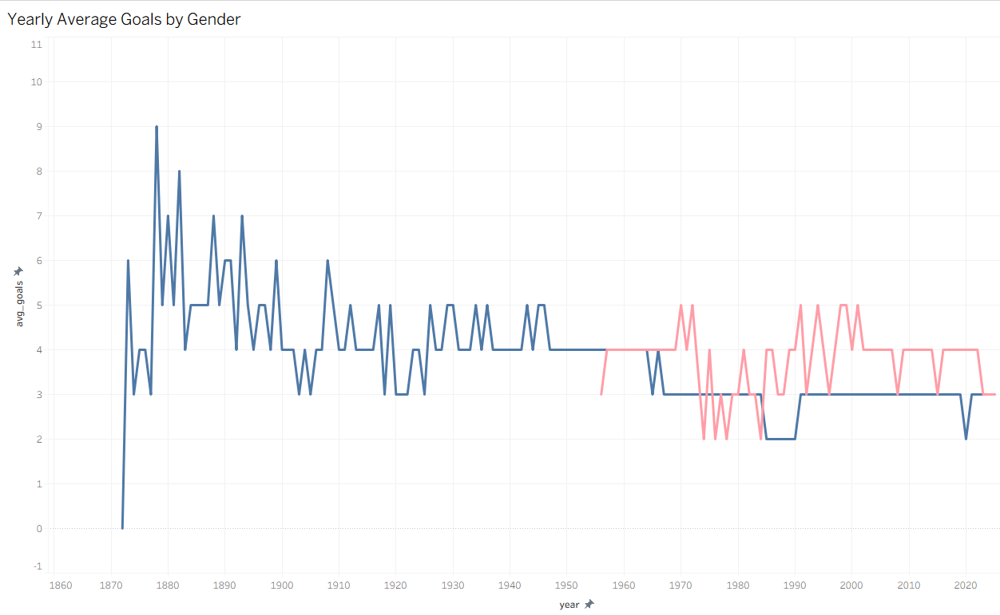
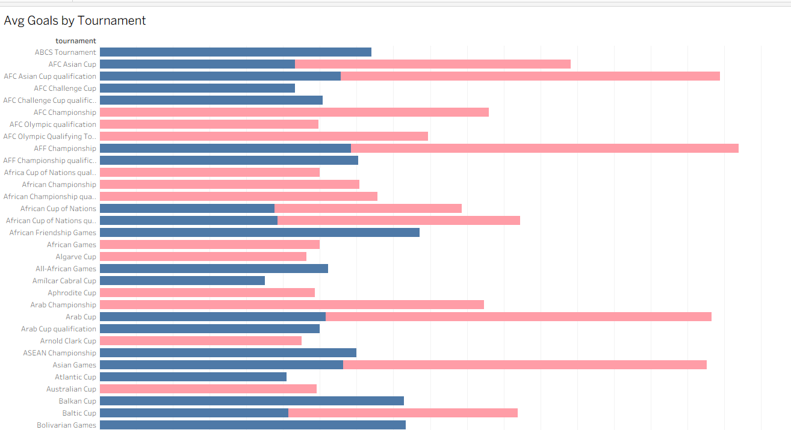
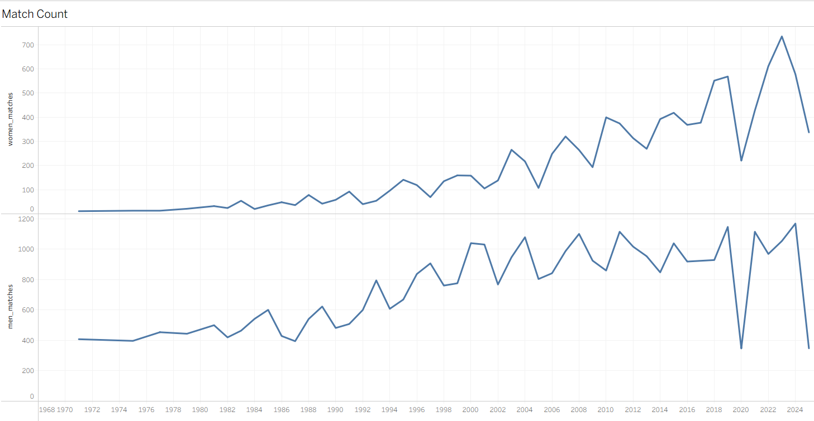
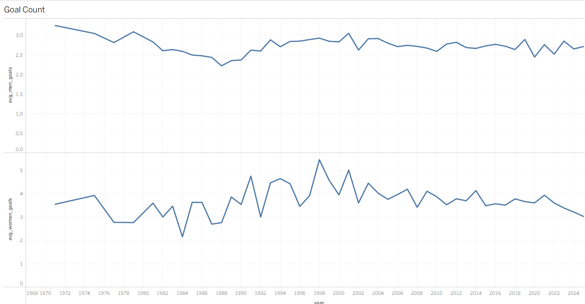

# ⚽ Football Results Analysis

Analyze scoring patterns in men’s and women’s international football matches, track trends over time, and compare tournaments using Python, SQL, and Tableau.

---

## ✅ Tools Used

- Python 3.11
- pandas
- SQLAlchemy
- psycopg2
- scipy
- PostgreSQL
- matplotlib
- Jupyter Notebook
- Tableau Public

---

## 📦 How to Use

**1️⃣ Clone the repository:**

git clone https://github.com/kacperguzydev/Football_Results_Analysis.git

**2️⃣ Install required packages:**

pip install -r requirements.txt

**3️⃣ Edit Config.py:**

POSTGRES = {
    "user": "your_username",
    "password": "your_password",
    "host": "localhost",
    "port": "5432",
    "database": "soccer_db"
}

**4️⃣ Prepare the data (run these scripts in order):**
- python merge_men.py
- python merge_women.py
- python load_to_db.py
- python sql_analysis.py
- python goals_over_time.py
- python gender_goal_difference.py

**5️⃣ Open the Tableau dashboard:**
- Open File in Dashboard/Football.twbx
## 🚀 Screenshots
- 🔮 Jupiter Notebook:

- 📅 Yearly Avg Goal By Gender:

- 🏆 Avg Goals by Tournamenty:

- ⚽ Match Count:

- ⚽ Goal Count:

